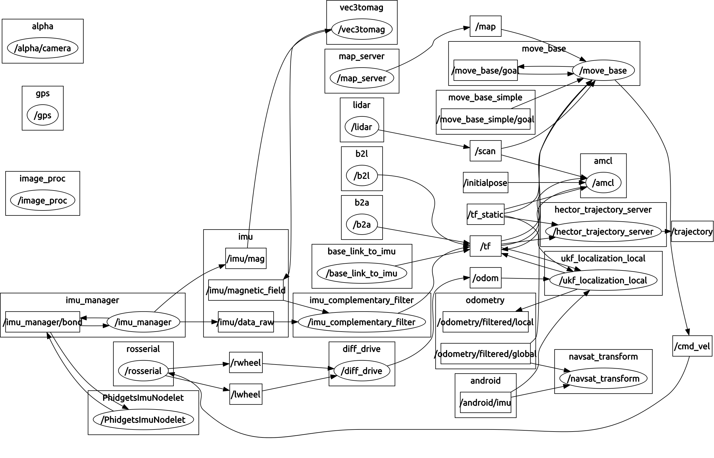

# Alphabot
---

Repository for **Alphabot**, an autonomous ground-rover whose goal is to dynamically maneuver and manipulate the environment.

Robotic Systems Integration, Olin College of Engineering, SP2017

## Connectivity Diagram



## Starting Up

1. Make sure that the battery is reasonably charged.

1. Make sure that **no bare wires are exposed**.

1. Flip the green switch at the top of the robot so that the - side is depressed. When doing this, it is recommended to have the e-stop pressed. -- TODO : add pictures

1. Release the e-stop if it is engaged.

1. Check the odroid monitor to see if the booting is in procedure.

1. Turn on the USB hub by pressing on the button on its side. -- TODO : check this statement

1. ssh into the robot:

	```bash
	ifconfig eth0
	nmap 10.42.0.0/24
	ssh odroid@10.42.0.79
	```
	
	Here, beware that eth0 may not be the name of your ethernet interface connected to the odroid. Also, the IP address 10.42.0.0 is assumed to have its first three bytes consistent with the subnet address found by the previous command (ifconfig). After the nmap returns 2 hosts up, ssh into the address that is not your own. The default password for the odroid is *odroid*.

1. [Optional] Run a screen session so that you don't have to ssh for every terminal:

	```bash
	screen
	```
	<C-a> c opens a new screen window.

	<C-a> a allows you to rename your current window.

	<C-a> " shows the list of screen windows that are currently open.

	<C-a> ' allows you to navigate to a known window name.

1. Launch roscore:

	```bash
	roscore
	```

1. Make sure that the android is connected to your ros master.

1. Bring the Robot UP:

	```bash
	roslaunch alpha_main bringup.launch
	```
